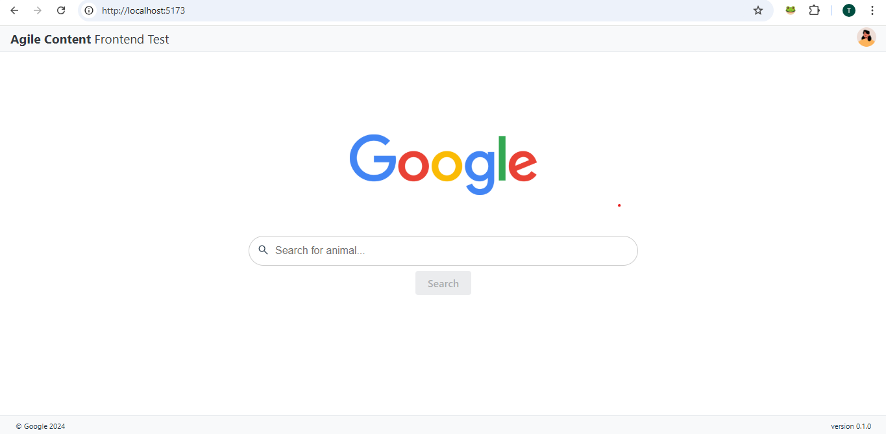
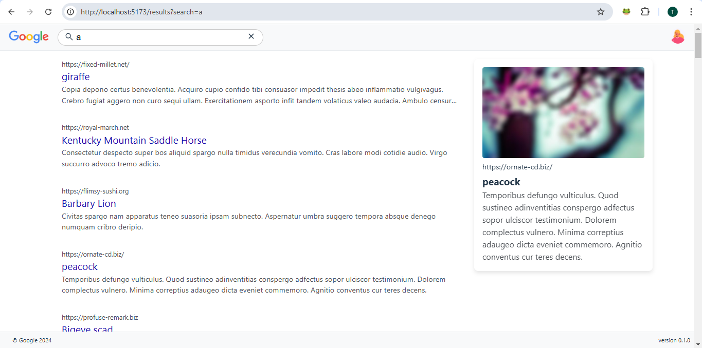

# Google Search Application | Agile Content

## Live Demo

- **[App Link](https://agile-content-search.vercel.app/)**

## Table of Contents

- [Overview](#overview)
- [Live Demo](#live-demo)
- [Features](#features)
- [Installation](#installation)
- [Docker Image Run](#docker-image-run)
- [Screenshots](#screenshots)

## Overview

This is a simple animal search application built using **Vite**, **React**, **TypeScript**, and **Jest** | **React Testing Library** for testing. It allows users to search for animals and view additional details for each animal. The app fetches fake data generated using **@faker-js/faker** and displays it in a clean, responsive UI.

## Features

- **HomePage**

  - **Search Input**: Allows users to search for animals by title or type. The results are displayed on the results page.
  - **Header & Footer**: These are static visual elements.

- **Results Page**
  - **Search Input in Header**: Lets users refine their search or search again.
  - **Display Results**: Shows the list of retrieved animals based on the search term.
  - **Item Selection**: When an animal item is clicked, additional information is displayed in a modal or sidebar based on width.
  - **No Results Message**: If no results are found, a message is displayed informing the user.
  - **No Search Term Message**: If the search term is empty, another message prompts the user to search for animals.

## Objectives

- Build a production-grade application.
- Focus on replicating the given design and functionality from the provided screenshots.
- Write at least one test case validating a key use case.
- **What Would You Have Done Differently if You Had More Time? Why?**
  If I had more time, I would have focused on:

  - **Implementing Pagination and Filtering**: This improve user experience by making it easier to navigate and find specific information.
  - **Optimizing Performance with List Virtualization**: Improve loading times and reduce memory usage, especially with large lists.
  - **Integrating Error Tracking with Sentry and Performance Monitoring with DataDog**: For better monitoring and faster issue resolution in production.
  - **Increasing Test Coverage**: Writing more comprehensive test cases and implementing end-to-end testing with Cypress.
  - **Adding Lazy Loading**: This might not required for such small App.

  These changes would enhance scalability, reliability, and the overall user experience.

## Technologies Used

- **Vite**: A fast build tool for the React application.
- **React**: The main library for building the UI.
- **TypeScript**: For static typing, improving code quality and maintainability.
- **React Testing Library (RTL)**: For unit and integration tests to ensure component functionality.
- **Jest**: Used for snapshot testing to ensure UI consistency.
- **Modular CSS**: The project uses **modular CSS** to scope styles locally to components, ensuring a clean and maintainable styling approach.
- **GitHub Actions**: Used for Continuous Integration (CI) to automate testing and deployment.
- **Docker**: Containerized the application for easy deployment and scaling.

## Installation

1. Clone the repository:
   ```bash
   git clone https://github.com/your-username/animal-search-app.git
   ```
2. Install dependencies:
   ```bash
   npm install
   ```
3. Start the development server:
   ```bash
   npm run dev
   ```

## Docker Image Run

1. After Step 2 (npm Install) use makefile commands
   ```bash
   make up-dev
   ```

- We can also use:
  ```bash
  npm run docker-up-dev
  ```

For information on using Docker with this project, refer to the [Docker Image Documentation](https://link-to-your-docker-image.com).

### Screenshots



